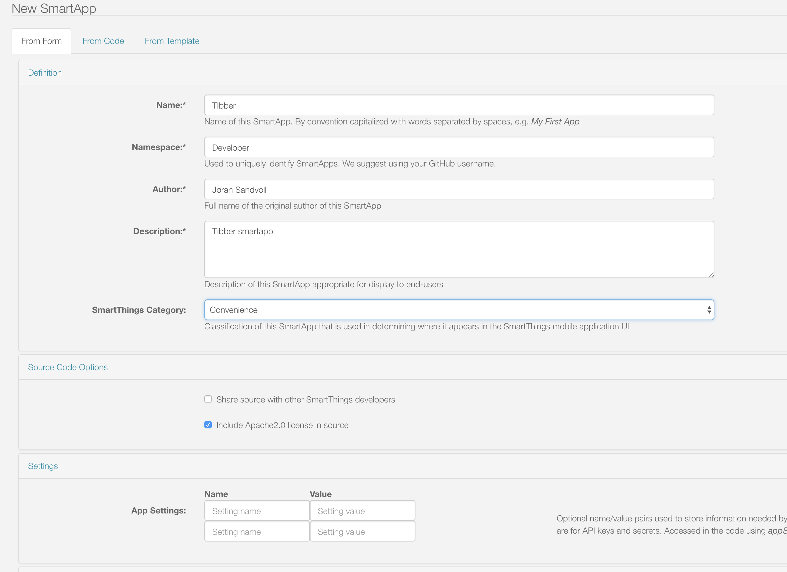

# Tibber - Samsung SmartThings thermostat integration
Tibber has a "double integration" with Samsung SmartThings;
1. Tibber SmartApp - this is described below. This integration connects thermostats in SmartThings to Tibber. The SmartThings thermostats will show up as "bubbles" in the Tibber app, and you can enable "smart heating" capabilities in Tibber.
2. [Tibber DeviceHandler in SmartThings](https://github.com/tibbercom/tibber-smartthings-app/tree/master/src/Device%20handlers). This DeviceHandler will show your live energy prices as a device/sensor in SmartThings.

# How to install
Read an follow the steps below **very carefully**
1. Create a new SmartApp in Samsung SmartThings developer portal (https://graph.api.smartthings.com/ide/apps) and make sure to enable OAuth.
2. From this git repository, copy the contents of [src/smartapp.groovy](https://github.com/tibbercom/tibber-smartthings-app/blob/master/src/smartapp.groovy).
3. Open the SmartApp in SmartThings developer portal and paste contents to code section.
4. Publish the app for yourself
5. Install the app
6. In the SmartThings app on your phone; go to "Automation" -> "Tibber Thermostat" -> "Access Token". You'll find the API key at https://developer.tibber.com/settings/accesstoken
7. Copy and keep the API token from step 6 and paste it into the Tibber app -> Power-ups -> Samsung SmartThings -> Connect

# Images

